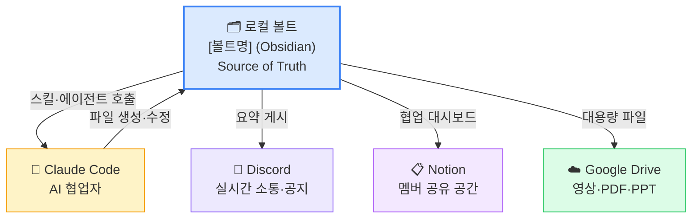

# 운영팀 온보딩 — Lv1: 첫날

> 이 시스템이 어떤 구조인지, 왜 이렇게 생겼는지 이해한다. 스킬을 실행하기 전에 지도를 먼저 읽는다.

---

## 이 레벨을 마치면

- 이 시스템에서 Obsidian, Claude Code, Discord의 역할을 각각 한 문장으로 설명할 수 있다
- 볼트 폴더 구조를 보고 어디에 무엇이 있는지 찾을 수 있다
- "Source of Truth"가 무엇인지, 왜 그것이 중요한지 말할 수 있다

---

## 1. 왜 이 시스템이 존재하는가

[클럽명]은 공동체다. 정기 세션을 운영하고, 소수의 운영팀이 기획·준비·기록·배포를 담당한다.

운영이 성장하면 정보가 사람의 머릿속에만 쌓인다. 담당자가 아프거나, 바쁘거나, 떠나면 흐름이 끊긴다. 이 볼트([볼트명])는 이 문제를 해결하기 위해 만들어졌다.

**원칙은 하나다:** 모든 운영 정보를 볼트에 담고, AI 에이전트가 반복 작업을 대신 처리한다. 운영자는 판단만 한다.

---

## 2. 전체 생태계 지도



*로컬 볼트가 모든 것의 원본이다. 나머지 플랫폼은 요약·미러·아카이브 역할만 한다.*

---

## 3. 폴더 구조 — 30초 지도

```
[볼트명]/
├── _system/        에이전트 설정, 규칙, 메모리
├── 01_ops/         운영 (회의, 재정, 멤버, 공지)
├── 02_sessions/    세션 (기획, 자료, 기록)
├── 03_projects/    프로젝트 (PRJ- 접두사)
├── 04_studio/      브랜드 에셋, 콘텐츠
├── 05_library/     리서치, 발행물, 시즌 아카이브
└── 06_inbox/       분류 전 임시 파일
```

**규칙:**
- 모든 운영 문서는 로컬 볼트에 먼저 작성한다
- 외부 플랫폼(Notion, Discord)에는 요약·링크만 게시한다
- 역방향(외부 → 로컬) 금지

---

## 4. Claude Code란 무엇인가

Claude Code는 터미널에서 실행하는 AI 협업자다. 볼트 루트에서 `claude`를 입력하면 시작된다.

```bash
cd /path/to/[볼트명]
claude
```

스킬(`.claude/skills/`)을 통해 반복 작업을 자동화한다:

```
운영자: /weekly-review
Claude Code: SKILL.md 읽기 → 볼트 스캔 → 보고서 생성 → 파일 저장
```

---

## 5. 에이전트 메모리 — 시스템의 기억

Claude Code는 새 대화를 시작할 때 기억이 없다. 메모리 파일이 이를 보완한다:

| 파일 | 역할 | 관리 방식 |
|------|------|----------|
| `_system/agents/memory/active-context.md` | 현재 클럽 상태 스냅샷 | 항상 **덮어쓰기** |
| `_system/agents/memory/change-log.md` | 변경 이력 | 날짜별 **append** |
| `_system/agents/memory/MEMORY.md` | 검증된 패턴·교훈 | `week-promote` 스킬이 관리 |

**새 대화 시작 시**: `active-context.md` 읽기 → 현재 상태 파악 → 작업 시작.

---

## 6. 오늘 해볼 것

1. `CLAUDE.md` 읽기 — 이 볼트의 전체 설명서
2. `_system/agents/memory/active-context.md` 읽기 — 현재 상태 파악
3. `_system/rules.md` 읽기 — 폴더·파일명·frontmatter 규칙
4. `02_sessions/` 폴더 열기 — 세션 파일 구조 확인

---

## 다음 단계

→ [[온보딩-Lv2-Week1]] — 주간 루틴 이해·첫 실행
