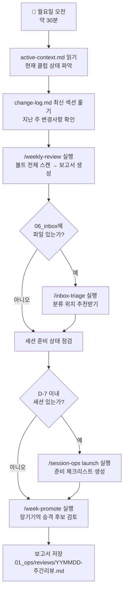

# 운영팀 온보딩 — Lv2: 첫 주

> 주간 루틴이 왜 존재하는지 이해하고, 처음으로 혼자 /weekly-review를 실행한다.

---

## 이 레벨을 마치면

- 주간 루틴의 각 단계가 왜 존재하는지 설명할 수 있다
- `/weekly-review`를 혼자 실행하고 결과를 올바른 위치에 저장할 수 있다
- 스킬이 내부에서 무슨 일을 하는지 개략적으로 설명할 수 있다

---

## 1. 왜 주간 루틴이 시스템의 심장인가

**cadence(박자)** 라는 개념으로 이해한다. 악기가 아무리 좋아도 연주하지 않으면 소리가 없다. 매주 월요일 오전 30분의 체크인이 시스템의 박자다. 이 박자가 멈추면 다음 사람이 컨텍스트를 잃는다.

주간 루틴이 하는 일:
1. 에이전트 메모리를 현재 상태로 유지한다
2. 처리되지 않은 파일(inbox)을 제때 정리한다
3. 패턴이 반복되면 장기기억으로 승격한다
4. 다음 세션 준비 상태를 사전에 점검한다

---

## 2. 주간 루틴 전체 흐름



*전체 흐름은 `RUNBOOK-볼트유지.md` 섹션 2에 체크리스트 형식으로도 있다.*

---

## 3. 각 단계를 "왜 하는가" 기준으로 이해하기

### active-context.md를 읽는 이유

Claude Code는 새 세션을 시작할 때 기억이 없다. `active-context.md`는 에이전트가 "지금 어디에 있는가"를 파악하는 첫 번째 파일이다. 이 파일은 **덮어쓰기** 전용이다. 과거 기록이 아니라 현재 스냅샷만 담는다 (50줄 이내 권장).

### /weekly-review가 하는 일

스킬이 실행되면 볼트를 스캔하고 다음 항목을 보고서에 담는다:
- 이번 주 추가·수정된 파일 목록
- 세션 준비 상태
- inbox 잔존 파일
- 미결 사항
- 다음 주 우선순위 제안

보고서를 `01_ops/reviews/YYMMDD-주간리뷰.md`에 저장한다.

### inbox-triage가 필요한 이유

`06_inbox/`에 파일이 쌓이면 처리 비용이 올라간다. `/inbox-triage`는 각 파일의 내용을 읽고 적절한 이동 위치를 추천한다. 운영자는 추천을 확인하고 승인하기만 한다.

### week-promote의 목적

같은 패턴이 2회 이상 관찰됐을 때만 "이건 패턴이다"라고 판단해 `long-term/knowledge.md`로 승격한다.

---

## 4. 스킬이란 무엇인가

스킬은 `.claude/skills/스킬명/SKILL.md`에 저장된 마크다운 파일이다. Claude Code가 `/스킬명`을 받으면 그 파일을 읽고 지시대로 실행한다.

### 스킬을 호출하면 일어나는 일

```
운영자: /weekly-review 입력
    ↓
Claude Code: SKILL.md 파일 읽기
    ↓
지시에 따라 볼트 파일 스캔
    ↓
보고서 초안 생성
    ↓
01_ops/reviews/YYMMDD-주간리뷰.md 저장
    ↓
운영자에게 완료 보고
```

> 스킬은 운영자의 승인 없이 파일을 삭제하거나 외부 플랫폼에 발행하지 않는다. (발행 스킬 제외)

---

## 5. FAQ

**Q: active-context.md가 오래된 것 같다. 어떻게 갱신하는가?**
A: `/memory-update`를 실행하거나 파일을 직접 열어 현재 상태로 덮어쓴다.

**Q: Claude Code를 어떻게 시작하는가?**
```bash
cd /path/to/[볼트명]
claude
```

**Q: week-promote와 memory-update의 차이는?**
A: week-promote는 패턴을 long-term으로 **승격**. memory-update는 active-context와 change-log를 **최신화**.

**Q: inbox에 파일이 없으면 inbox-triage를 안 해도 되는가?**
A: 맞다. `06_inbox/`에 미분류 파일이 있을 때만 실행한다.

---

## 다음 단계

주간 루틴을 혼자 한 번 완주했다면 → [[온보딩-Lv3-Month1]]
