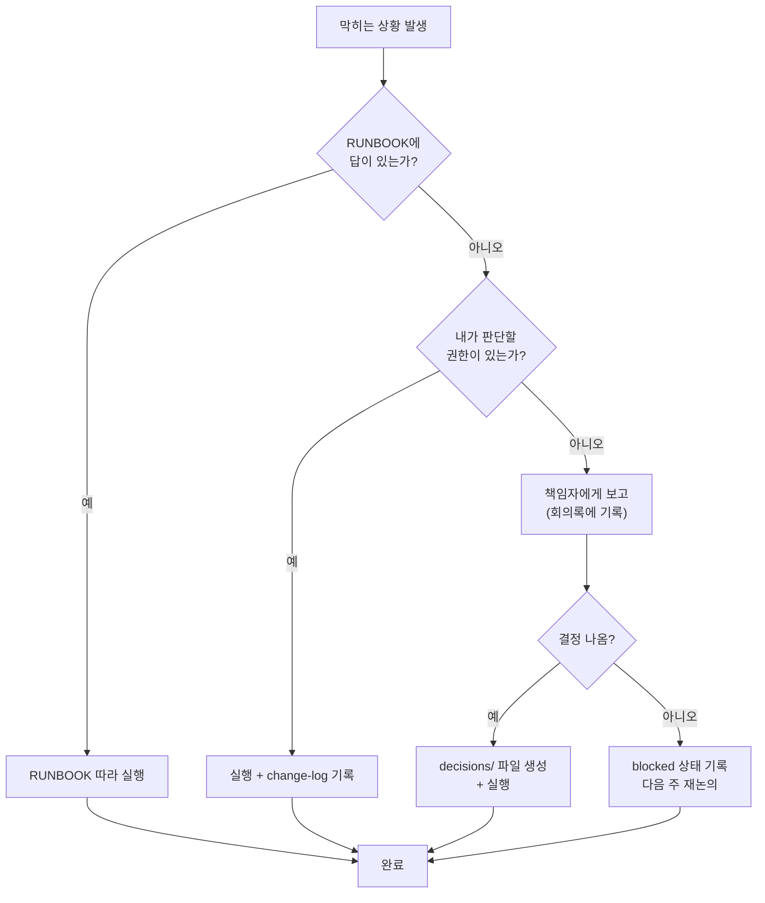

# 운영팀 온보딩 — Lv3: 첫 달

> 세션 수명주기 전체를 혼자 완주한다. 기획부터 발행까지 한 번 돌리면 시스템이 몸에 밴다.

---

## 이 레벨을 마치면

- 세션 하나의 수명주기(기획 → 준비 → 진행 → 기록 → 발행)를 독립적으로 완주할 수 있다
- `/session-ops`의 4가지 서브커맨드를 언제 쓰는지 설명할 수 있다
- 무언가 막혔을 때 스스로 RUNBOOK을 보고 해결할 수 있다
- 클럽 패턴 관찰을 멤버 기억으로 승격하는 판단을 내릴 수 있다

---

## 1. 세션이 클럽에서 갖는 의미

세션은 클럽의 가장 가시적인 산출물이다. 멤버들은 세션을 통해 클럽의 가치를 체험하고, 운영팀은 세션을 통해 역량을 쌓는다.

운영팀에게 세션은 **단순한 이벤트가 아니라 사이클**이다. 한 세션을 잘 마치면 다음 세션의 재료가 생긴다. 기록이 쌓이면 패턴이 보이고, 패턴이 보이면 클럽이 성장한다.

---

## 2. 세션 수명주기 전체 지도

```
D-21          D-7           D-3           D+0          D+1
 |             |             |             |             |
 ▼             ▼             ▼             ▼             ▼
기획 시작     준비 점검     최종 리허설   세션 진행     기록 완성
/session-ops  /session-ops  체크리스트    (실시간)      /session-ops
   setup        launch       재확인                      record
```

각 단계는 다음 단계의 전제 조건이다. 기획이 없으면 준비 점검이 없고, 준비가 없으면 세션이 없다.

---

## 3. 각 단계의 판단 기준

### D-21: `/session-ops setup`

- 세션 폴더 (`02_sessions/S{NN}-제목/`) 생성
- `plan.md` 초안 작성 — 주제, 목표, 예상 진행 방식

**판단 기준**: 주제가 확정되고 날짜가 잡혔을 때 실행한다.

### D-7: `/session-ops launch`

- 준비 상태 전체 점검
- 자료, 슬라이드, 참석 확인, 공지 발행 여부

**판단 기준**: 세션 7일 전. 이때 누락된 것이 있으면 D-3 전에 마무리한다.

### D+0 중: 세션 진행

- 운영자는 진행에 집중한다
- Claude Code는 별도 세션 (`/session-ops guard`)으로 에이전트 작업을 격리한다

**판단 기준**: 세션 중 Claude Code를 사용해야 할 때는 `guard` 세션을 열어 범위를 제한한다.

### D+1: `/session-ops record`

- 세션 후 `record.md` 완성
- 참석자, 핵심 논의, 결정, 다음 액션 기록

**판단 기준**: 세션 직후(당일 또는 익일) 기억이 생생할 때 실행한다.

---

## 4. 기억 만들기 — 클럽 패턴을 장기기억으로

세션을 반복하다 보면 클럽만의 패턴이 보인다. 이것을 장기기억으로 승격하는 것이 `/week-promote`의 역할이다.

### 승격 판단 기준

| 관찰 유형 | 승격 기준 | 목적지 |
|----------|---------|--------|
| 멤버 반응 패턴 | 3회 이상 반복 | `MEMORY.md` — 멤버 성향 |
| 효과적인 운영 방법 | 2회 이상 효과 확인 | `MEMORY.md` — 운영 패턴 |
| 실패·교훈 | 원인이 명확할 때 1회도 가능 | `MEMORY.md` — 교훈 |

**한 번 보고 "이 클럽은 이렇구나"라고 확신하지 않는다.** 패턴은 반복으로 검증된다.

---

## 5. 시스템 건강 유지

세션 사이클을 돌리다 보면 시스템이 쌓인다. 월 1회 정도 건강 점검이 필요하다.

```
/verify-implementation
    ↓
vault-health → frontmatter-scan → tag-audit → link-audit
    ↓
이상 없으면 → 계속 운영
이상 있으면 → 해당 스킬로 수동 수정
```

스킬이나 에이전트를 개선했다면 `/release`로 버전을 남긴다.

---

## 6. 내가 결정할 것 vs 물어볼 것



"내가 판단할 권한"의 기준: 기존 결정(decisions/)이나 규칙(rules.md)에 근거가 있으면 독립 판단 가능.

---

## 7. 이 수준에 도달했다는 것의 의미

Lv3를 완주하면 단순 실행자가 아니라 **시스템 공동 관리자**가 된다.

시스템은 한 사람이 설계하고 여러 사람이 유지한다. 새로 합류한 운영자가 시스템을 이해하고 개선에 참여할 수 있을 때, 클럽은 진짜로 지속 가능해진다.

앞으로 막히는 상황이 생기면 → `RUNBOOK-볼트유지.md`가 1차 참조다.

---

## 다음 단계

시스템을 개선하고 싶다면 → `.claude/skills/` 폴더의 스킬 파일을 직접 수정해보는 것을 추천한다.
